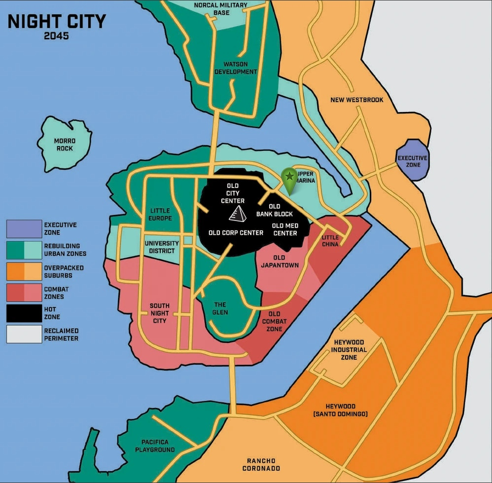

# Найт-Сити

## Краткая история

Найт-Сити - это мечта. Мечта основателя, миллионера-филантропа Ричарда Найта, который насмотрелся на жестокость и беззаконие в США после Коллапса. 

Он задумывал Коронадо-Сити (а именно так тогда он назывался) как организованный и самодостаточный город, который смог противостоять самой решительной преступности. Проект был амбициозным, далеко идущим и дальновидным в своем подходе.

В 1992-м Найт смог заручиться поддержкой 3-х мегакорпораций: Arasaka Security, EBM и Petrochem. Они были заинтересованы в создании города, где во главе правительства были бы корпорации.

В 1993-м на западном побережье Калифорнии, на берегу переименованного залива Дель-Коронадо был искусственно отсыпан фундамент будущего Коронадо-Сити.

В 1994-м наконец началась полномасштабная стройка. Организованная преступность пыталась внедриться в процесс постройки и заиметь власть в городе, но после неудачи они решили убить Ричарда Найта. 20 сентября 1998 он был застрелен в только что построенном пентхаусе. Убийца так и не был найден. В честь отца город был назван Найт-Сити.

После завершения постройки часть задумок Ричарда воплотилась. Появился Корпоративный Центр, где власть принадлежала корпорациям. Однако остальную часть города захватили различные банды. Так и появились печально известные Боевые Зоны, когда корпорации и бандиты делили ресурсы города. Полиция в таком положении оказалась бессильна. 

Спустя какое-то время, к 2005 банды и организованная преступность смогли поставить своих ставленников в совет и занять даже больше территорий, чем принадлежало корпорациям. 

Устав это терпеть, в 2009 году корпорации начали войну против преступности. Ударные отряды вышли на улицы и с бронетехникой начали уничтожать бандформирования. Не из чувства долга перед гражданами, нет конечно, а потому что банды начали приносить убытки. 

В 2011-м году у руля вновь оказались корпорации. Они поставили марионеточного мэра, заново создали экстренные службы и добились какого-никакого но хрупкого мира. Город медленно, но уверенно развивался и расширялся до 2021 года.

В 2022-м году пришла Четвертая Корпоративная Война. Arasaka и Militech две самые крупные корпорации в мире устроили бойню прямо на улицах Найт-Сити. Все это закончилось 20.08.2023 тем, что в здании Arasaka Towers был взорван ядерный заряд. Предположительно, это сделала сама Arasaka, чтобы не дать Militech захватить здание. После этого японская дзайбацу с позором бежала не только из Найт-Сити, но и в целом с территории Американских континентов. НСША признали ее террористической организацией и аннулировали все чартеры.

Два года небо над Найт-Сити было красного цвета. Это время стали называть Красной Эпохой. Однако город выжил. 

## Карта города

### Легенда

Executive Zone - временный корпоративный район, самая охраняемая и дорогая, идеал для корпоратов и других важных лиц. 6x стоимость проживания. 

Rebuilding Urban Zones - восстанавливающиеся жилые районы, вторые по цене и охраняемости. Классический городской район. 4х стоимость проживания.

Overpacked Suburbs - многоэтажные жилые или пригородные районы, огромные ряды человейников и мегаскребов. (Можно вспомнить трущобы Индии или фавелы в Бразилии). 2х стоимость.

Combat Zones - боевые зоны, классика Найт-Сити: куча банд, ноль охраны, полиция только делает вид, что охраняет, зато дешево и сердито. 1х стоимость проживания.

Hot Zone - радиоактивный пепел и развалины бывшего корпоративного центра. 

Reclaimed Perimeter - территория за пределами власти Найт-Сити. 

“Черная пирамида” - эпицентр взрыва ядерной бомбы.

“Зеленый маркер” - бар Посмертие.
